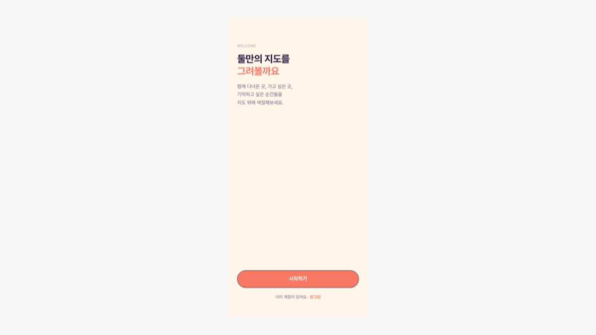

# couple-map

[한국어](README.md) | **English**

A mobile PWA for recording shared places and memories on maps and timelines.

Restaurants, cafés, and date spots can be saved to a Kakao map, while visited regions are filled across Korea and world maps. Two people share the same records and manage anniversaries, letters, conversations, and time capsules in one place.



## Core experience

- **Record a place**: move from place search to a map pin, photos, and notes in one flow.
- **Browse memories**: find the same record by map, region, timeline, or calendar.
- **Share data safely**: couple-scoped permissions protect shared records and reactions, with Firestore rules tested separately.
- **Use it on mobile**: navigation and fixed controls fit a 430px app frame, with clear offline and save-state feedback.

---

## Screenshots


## Getting Started

```bash
npm install
npm run dev          # http://localhost:6173
npm run build       # tsc -b && vite build
npm run lint
npm test            # Vitest
npm run test:rules  # Firestore security rules test (firebase emulator)
```

### Environment Variables

```
VITE_KAKAO_APP_KEY=       # Kakao Maps JavaScript key
VITE_KAKAO_REST_API_KEY=  # Kakao REST API key
VITE_FIREBASE_*=          # Firebase config
```

---

## Tech Stack

| Area | Technology |
|---|---|
| Framework | React 19 + Vite + TypeScript |
| Styling | Tailwind CSS 4 (`@theme` tokens in `global.css`) |
| UI | Radix UI + shared components |
| State | Zustand (`use-auth-store`) + Context (Theme / Auth) |
| Backend | Firebase — Auth · Firestore · Storage |
| Maps | Kakao Maps SDK (`react-kakao-maps-sdk`) + d3-geo (region maps) |
| Animation | Framer Motion |
| Forms | react-hook-form + zod |
| Error tracking | Sentry |

---

## Features

| Category | Pages |
|---|---|
| **Recording** | Today(daily log) · Travel(map) · Timeline · MemoryDetail · Compose · PhotoEditor · VoiceMemo |
| **Maps** | KakaoMapView(pins) · KoreaGeoMap / SeoulGeoMap(region fill) · RegionDetail · Explore |
| **Couple** | Chat · DailyQuestion · CoupleChallenge · Anniversary · TimeCapsule · LocationShare |
| **Organization** | Calendar · Stats · Search · Travelogue · Print · ShareCard · Stickers |
| **Misc** | DateRoulette · DateExpenses · Notifications · Profile · Onboarding |

The `pages/add/` flow is a four-step place add: country select → region select → place search → pin form.

---

## Project Structure

```
src/
├── components/
│   ├── ui/        Shared UI — typography · pill · list-row · glass-list
│   │              stat-card · profile-card · empty-state
│   ├── maps/      KoreaGeoMap · SeoulGeoMap · KakaoMapView
│   ├── layout/    MainLayout · BottomNav
│   ├── shared/    AddSheet · OfflineBanner · SoloModeBanner · ErrorModal
│   ├── micro/     PinDrop · RegionFill · DDayCounter · PartnerSync
│   │              PressButton · TabIndicator
│   └── auth/
├── contexts/      ThemeContext(palette/mode/font) · AuthContext
├── services/      Firebase API — firebase · places · couple · memories · comments
│                  reactions · notifications · anniversaries · letters · chat
│                  challenges · daily-question · expenses · stickers · travelogues
│                  upload · account · data-export
├── lib/           Pure utils — animations · countries · regions · toast · utils
├── pages/         Screens (+ pages/add/ place add flow)
├── store/         use-auth-store (zustand)
├── types/         place · kakao
└── styles/        global.css (design tokens + glass utilities) · font.css

firestore.rules      Security rules (test: npm run test:rules)
firestore.indexes.json
```

---

## Design System

See **[docs/ARCHITECTURE.md](docs/ARCHITECTURE.md)** and `.claude/rules/design-system.md` for details.
The core principle is **"don't write styles directly"**.

- **Themes**: 6 palettes (coral default · sage · blue · purple · yellow · black) ×
  3 modes (light / dark / system) × 2 font presets (Pretendard / Gaegu handwriting)
- **Tokens**: `--app-font` · `--app-radius` · `--app-stroke` · `--app-shadow` ·
  `--app-card` · `--app-line` · `--app-line-soft` · `--accent-*`
- **Glass utilities**: `glass` · `glass-pill` · `glass-card` · `glass-bar`
- **Typography**: Use component imports — `<H1> <H2> <H3> <Body> <Meta> <Tiny> <Emphasis>`
- **Layout**: App max-width **430px centered** (mobile PWA).
  All `fixed` elements use `left-1/2 -translate-x-1/2 w-full max-w-[430px]`

### Do's and Don'ts

| Don't | Do |
|---|---|
| Raw text classes | Typography components |
| Inline glass styles | glass CSS utilities |
| Hardcoded colors | CSS variables (`--accent-*`, `--app-*`) |
| `border-couple-gray-*` dividers | `var(--app-line-soft)` |
| Ad-hoc lists/empty states | `GlassList` + `ListRow`, `EmptyState` |

All buttons are `rounded-full` and all cards use the `glass-card` utility.

---

## Documentation

| Document | Contents |
|---|---|
| [docs/ARCHITECTURE.md](docs/ARCHITECTURE.md) | Architecture · Data model · Design system |
| [CLAUDE.md](CLAUDE.md) | Work rules (full design system table) |
| `.claude/rules/design-system.md` | Full token table |
| [TODOS.md](TODOS.md) | Open tasks |

[`docs/archive/PROJECT_OVERVIEW.md`](docs/archive/PROJECT_OVERVIEW.md) is retained as an early planning record. This README and `docs/ARCHITECTURE.md` describe the current React 19 and Vite implementation.

---

## License

**Source-available — not open source.** The code is publicly readable, but we haven't granted usage rights. To use this in another project, redistribute, or commercialize, you'll need written permission first. See [LICENSE](LICENSE) for details and [LICENSE.ko.md](LICENSE.ko.md) for Korean guidance.
