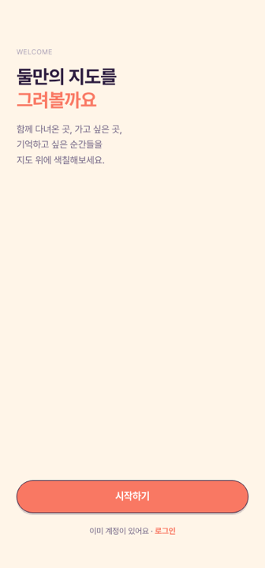

# Couple App

> **About (EN)** — A mobile-first PWA for couples to record and share where
> they've been together: pin restaurants, cafés and date spots on a Kakao map,
> fill in a Korea/world region map as you travel, keep a shared timeline,
> anniversaries, letters, chat and a time capsule. React 19 + Vite + Firebase,
> with a six-palette themeable glass design system.

커플이 함께 다닌 곳을 기록하고 공유하는 모바일 PWA.

맛집·카페·데이트 장소를 카카오 지도에 핀으로 남기고, 다녀온 지역이 지도에 채워지고,
타임라인·기념일·편지·채팅·타임캡슐까지 한 앱에 모은다.

---

## 스크린샷



## 실행

```bash
npm install
npm run dev          # http://localhost:6173
npm run build       # tsc -b && vite build
npm run lint
npm test            # Vitest
npm run test:rules  # Firestore 보안 규칙 테스트 (firebase 에뮬레이터)
```

### 환경 변수

```
VITE_KAKAO_APP_KEY=       # Kakao Maps JavaScript 키
VITE_KAKAO_REST_API_KEY=  # Kakao REST API 키
VITE_FIREBASE_*=          # Firebase 설정
```

---

## 기술 스택

| 영역 | 사용 기술 |
|---|---|
| 프레임워크 | React 19 + Vite + TypeScript |
| 스타일 | Tailwind CSS 4 (`global.css`의 `@theme` 토큰) |
| UI | Radix UI + 자체 공통 컴포넌트 |
| 상태 | Zustand (`use-auth-store`) + Context (Theme / Auth) |
| 백엔드 | Firebase — Auth · Firestore · Storage |
| 지도 | Kakao Maps SDK (`react-kakao-maps-sdk`) + d3-geo (지역 지도) |
| 애니메이션 | Framer Motion |
| 폼 | react-hook-form + zod |
| 에러 | Sentry |

---

## 주요 기능

| 영역 | 페이지 |
|---|---|
| **기록** | Today(오늘의 기록) · Travel(지도) · Timeline · MemoryDetail · Compose · PhotoEditor · VoiceMemo |
| **지도** | KakaoMapView(핀) · KoreaGeoMap / SeoulGeoMap(지역 채우기) · RegionDetail · Explore |
| **관계** | Chat · DailyQuestion · CoupleChallenge · Anniversary · TimeCapsule · LocationShare |
| **정리** | Calendar · Stats · Search · Travelogue(여행기) · Print · ShareCard · Stickers |
| **기타** | DateRoulette(데이트 룰렛) · DateExpenses(데이트 비용) · Notifications · Profile · Onboarding |

`pages/add/`는 장소 추가 플로우다: 국가 선택 → 지역 선택 → 장소 검색 → 핀 폼.

---

## 프로젝트 구조

```
src/
├── components/
│   ├── ui/        공통 UI — typography · pill · list-row · glass-list
│   │              stat-card · profile-card · empty-state
│   ├── maps/      KoreaGeoMap · SeoulGeoMap · KakaoMapView
│   ├── layout/    MainLayout · BottomNav
│   ├── shared/    AddSheet · OfflineBanner · SoloModeBanner · ErrorModal
│   ├── micro/     PinDrop · RegionFill · DDayCounter · PartnerSync
│   │              PressButton · TabIndicator
│   └── auth/
├── contexts/      ThemeContext(팔레트/모드/폰트) · AuthContext
├── services/      Firebase API — firebase · places · couple · memories · comments
│                  reactions · notifications · anniversaries · letters · chat
│                  challenges · daily-question · expenses · stickers · travelogues
│                  upload · account · data-export
├── lib/           순수 유틸 — animations · countries · regions · toast · utils
├── pages/         화면 (+ pages/add/ 장소 추가 플로우)
├── store/         use-auth-store (zustand)
├── types/         place · kakao
└── styles/        global.css (디자인 토큰 + glass 유틸) · font.css

firestore.rules      보안 규칙 (테스트: npm run test:rules)
firestore.indexes.json
```

---

## 디자인 시스템

상세는 **[docs/ARCHITECTURE.md](docs/ARCHITECTURE.md)**와 `.claude/rules/design-system.md`.
요점은 **"직접 스타일을 쓰지 않는다"**이다.

- **테마**: 팔레트 6종(coral 기본 · sage · blue · purple · yellow · black) ×
  모드 3종(light / dark / system) × 폰트 2종(Pretendard / 개구쟁이 손글씨)
- **토큰**: `--app-font` · `--app-radius` · `--app-stroke` · `--app-shadow` ·
  `--app-card` · `--app-line` · `--app-line-soft` · `--accent-*`
- **글래스 유틸**: `glass` · `glass-pill` · `glass-card` · `glass-bar`
- **타이포**: `<H1> <H2> <H3> <Body> <Meta> <Tiny> <Emphasis>` 컴포넌트로만
- **레이아웃**: 앱 최대 폭 **430px 중앙 정렬**(모바일 PWA).
  모든 `fixed` 요소는 `left-1/2 -translate-x-1/2 w-full max-w-[430px]`

### 금지 목록

| 하지 말 것 | 대신 |
|---|---|
| 생 텍스트 클래스 | Typography 컴포넌트 |
| 인라인 글래스 스타일 | glass CSS 유틸 |
| 하드코딩 색상 | CSS 변수 (`--accent-*`, `--app-*`) |
| `border-couple-gray-*` 구분선 | `var(--app-line-soft)` |
| 애드혹 리스트/빈 상태 | `GlassList` + `ListRow`, `EmptyState` |

모든 버튼은 `rounded-full`, 모든 카드는 `glass-card`다.

---

## 문서

| 문서 | 내용 |
|---|---|
| [docs/ARCHITECTURE.md](docs/ARCHITECTURE.md) | 아키텍처 · 데이터 모델 · 디자인 시스템 |
| [CLAUDE.md](CLAUDE.md) | 작업 규칙 (디자인 시스템 전체 표 포함) |
| `.claude/rules/design-system.md` | 토큰 전체 표 |
| [TODOS.md](TODOS.md) | 남은 작업 |

> ⚠️ `docs/PROJECT_OVERVIEW.md`는 **초기 기획 시점 문서**로, 스택 설명(Next.js 14)이
> 현재 구현(React 19 + Vite)과 다르다. 현행 기준은 이 README와 `docs/ARCHITECTURE.md`다.

---

## 라이선스

**Source-available — 오픈소스가 아닙니다.** 코드를 읽을 수 있게 공개했을 뿐,
사용 권한을 준 것은 아닙니다. 다른 프로젝트에 가져다 쓰거나 재배포·상업적 이용을
하려면 사전 서면 허락이 필요합니다. 전문은 [LICENSE](LICENSE), 한국어 안내는 [LICENSE.ko.md](LICENSE.ko.md) 참조.

